<div align="center">


# 🎯 PlacementOS

### *"One Platform. Every Tool You Need to Crack Placement."*

**AI-powered career platform for engineering students preparing for campus placements in India**

<br/>

[](https://placement-os-mu.vercel.app)
[](https://github.com/PrashantSinghUP64/PlacementOS)
[](https://www.linkedin.com/in/prashant-kumar-singh-51b225230/)

<br/>


<br/>


</div>

---

## 📌 Table of Contents

- [🎯 About the Project](#-about-the-project)
- [🔑 Try It Live](#-try-it-live)
- [🔥 The Problem I Solved](#-the-problem-i-solved)
- [✨ Features (20+)](#-features-20)
- [📸 Screenshots](#-screenshots)
- [🏗️ Architecture & Tech Stack](#️-architecture--tech-stack)
- [🧠 Key Technical Challenges Solved](#-key-technical-challenges-solved)
- [⚙️ Installation & Setup](#️-installation--setup)
- [🌐 Deployment](#-deployment)
- [💡 What Makes It Unique](#-what-makes-it-unique)
- [🗺️ Roadmap](#️-roadmap)
- [👤 About the Creator](#-about-the-creator)
- [📄 License](#-license)

---

## 🎯 About the Project

**PlacementOS** is a full-stack, AI-powered placement preparation platform built specifically for engineering students preparing for campus placements in India.

Instead of juggling 5–6 different websites — one for resume review, one for mock interviews, one for DSA, one for job tracking — **PlacementOS brings everything into one clean, intelligent dashboard.**

> *"I built this because I faced the same problem my batchmates faced. Placement prep is already stressful — your tools shouldn't add to that stress."*
> — Prashant Kumar Singh, Creator

---

## 🔑 Try It Live

> No setup needed — just open and explore!

| | |
|---|---|
| 🔗 **Live URL** | [https://placement-os-mu.vercel.app](https://placement-os-mu.vercel.app) |
| 📧 **Login** | Sign in with **Google** (one click) or create free account |
| ⚡ **Quick Test** | Click **"Analyze My Resume"** → Upload any PDF → See AI analysis in seconds |

---

## 🔥 The Problem I Solved

| Before PlacementOS ❌ | With PlacementOS ✅ |
|---|---|
| 5+ tabs open simultaneously | One unified dashboard |
| No AI-powered resume feedback | Instant AI Resume Analysis with ATS Score |
| No mock interview practice tool | AI-driven Mock Interview with real Q&A |
| No way to track job applications | Built-in Job Tracker |
| No DSA progress tracking | DSA Tracker with problem sets |
| No campus-specific placement data | Campus Data & Company Intel built-in |
| Scattered free resources | Curated Student Toolkit in one place |

---

## ✨ Features (20+)

### 🔍 Core AI Tools
| Feature | Description |
|---|---|
| **Resume Analyzer** | Upload PDF + job description → ATS Score, Skill Match, Missing Keywords, Strengths, AI Suggestions |
| **Resume Roast** | Brutally honest AI feedback — like a senior engineer reviewing your resume |
| **Mock Interview** | AI-powered Q&A session tailored to your target role |
| **Skill Gap Analysis** | Identifies exactly what skills are missing for your dream role |
| **Cover Letter Generator** | AI-crafted personalized cover letters in seconds |

### 📊 Dashboard & Tracking
| Feature | Description |
|---|---|
| **Smart Dashboard** | Total Analyses, Best Score, Avg Score, Improvement — all in real-time |
| **Score Progress Chart** | Visual graph of your resume score improvement over time |
| **Recent Analyses** | Quick access to all past analysis results |
| **Job Tracker** | Track applications — applied, in-progress, offers |

### 🛠️ AI Explore Tools
| Feature | Description |
|---|---|
| **Interview Prep** | Role-specific Q&A with model answers |
| **Resume Builder** | Build ATS-optimized resume with AI tips |
| **Salary Check** | Market salary predictions for your role + location |
| **LinkedIn Tips** | Optimize LinkedIn profile for recruiter visibility |

### 🏫 Placement Ecosystem
| Feature | Description |
|---|---|
| **Career Guide** | GATE, PSU, YouTube, MBA — all paths explained |
| **AI Roadmap** | Custom study plans for your target company |
| **Leaderboard** | Compete and rank with batchmates |
| **DSA Tracker** | Track problem-solving with difficulty-wise filtering |
| **Company Intel** | Salaries, rounds, interview patterns company-wise |
| **Referrals** | Connect with alumni for referrals |
| **Job Board** | Aggregated hiring alerts from top companies |

### 🎒 Student Toolkit
| Feature | Description |
|---|---|
| **Free Resources** | Curated free course alternatives |
| **Hackathons** | Find and win hackathons relevant to your stack |
| **Certifications** | What's actually worth doing |
| **GitHub Profile Optimizer** | Impress recruiters with a better GitHub |
| **LinkedIn Builder** | Step-by-step profile creation guide |

---

## 📸 Screenshots

### 🌟 Landing Page — First Impression
> "India's #1 Placement Companion" — Bold, dark-themed hero with clear CTAs

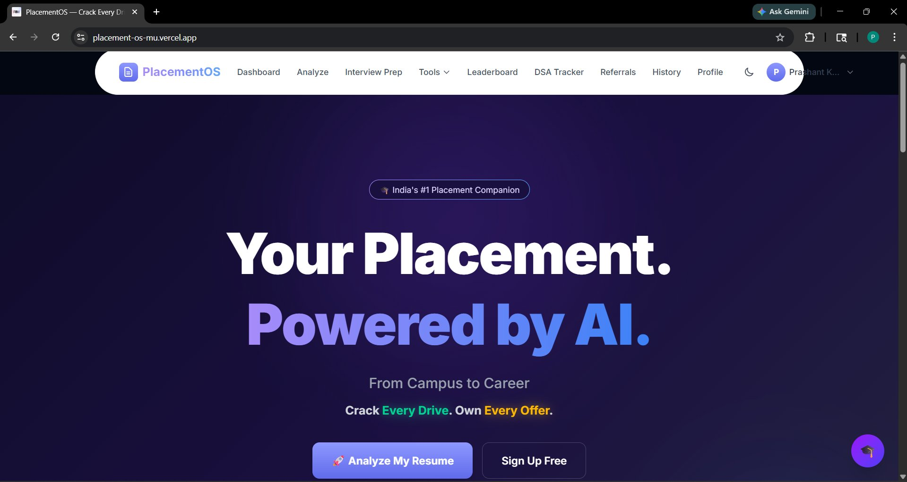

*"Your Placement. Powered by AI." — From Campus to Career. Crack Every Drive. Own Every Offer.*
Two CTAs: **🚀 Analyze My Resume** (primary) + **Sign Up Free** (secondary) — conversion-optimized design.

---

### 🔄 How PlacementOS Works — 3 Simple Steps
> Clean onboarding flow — new users instantly understand the product in seconds

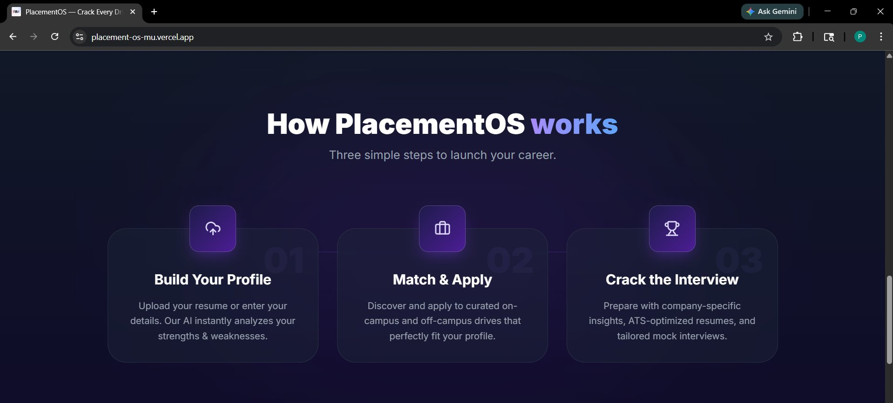

| Step | Action | What Happens |
|---|---|---|
| 01 | **Build Your Profile** | Upload resume → AI analyzes strengths & weaknesses instantly |
| 02 | **Match & Apply** | Discover curated on-campus & off-campus drives matching your profile |
| 03 | **Crack the Interview** | Company-specific insights, ATS-optimized resume, tailored mock interviews |

---

### 🔐 Login Page — Production-Grade Authentication
> Multiple login options — Email/Password, OTP (passwordless), and Google OAuth

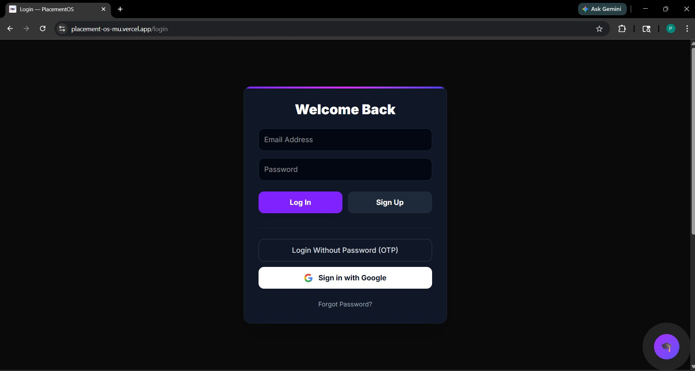

*Powered by **Supabase Auth** — JWT sessions, Row-Level Security, Google OAuth integration.*
Features: Email+Password login, **OTP (passwordless)**, **Sign in with Google**, Forgot Password flow.

---

### 🖥️ Dashboard — Smart Analytics

**Before analysis (fresh login):**

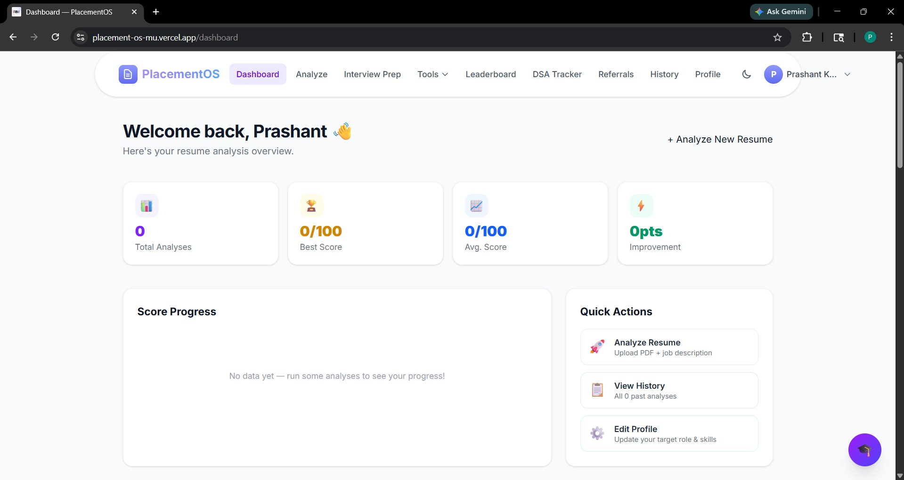

**After uploading resume — dashboard updates live:**

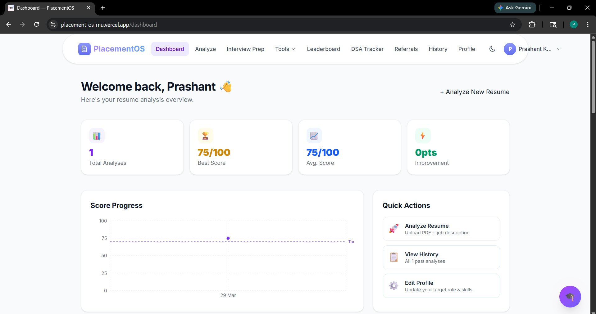

*Total Analyses: 1 | Best Score: 75/100 | Avg Score: 75/100 | Score Progress Chart auto-generated*

---

### 🔍 Resume Analyzer — Detailed AI Result
> Upload PDF + paste job description → get complete analysis in seconds

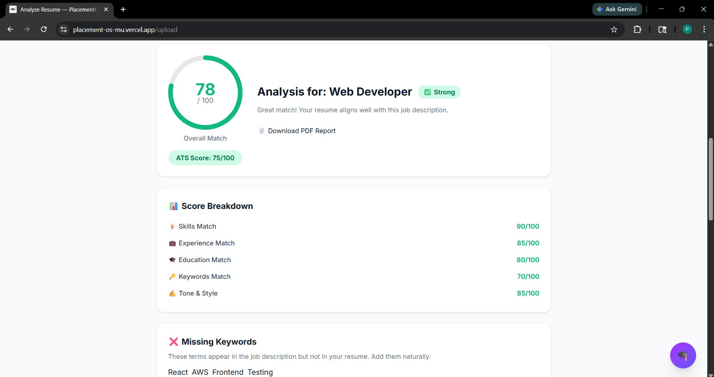

- **Overall Match: 78/100** for Web Developer → Status: **Strong** ✅
- **ATS Score: 75/100**
- Score Breakdown: Skills 90 | Experience 85 | Education 80 | Keywords 70 | Tone 85

---

### ✅ Strengths & ⚠️ Improvements
> Side-by-side view — know exactly what to keep and what to fix

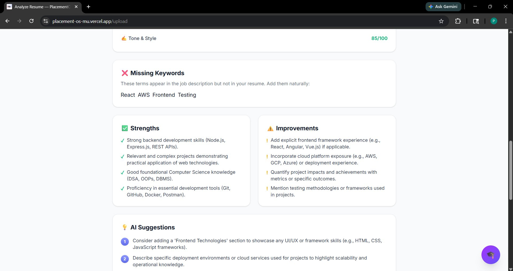

**Strengths:** Node.js, REST APIs, Complex Projects, DSA/OOPs/DBMS, Git/Docker/Postman

**Improvements:** Add React/Angular, Cloud platform exposure (AWS/GCP), Quantify project impact

---

### 💡 AI Suggestions — 5 Specific Numbered Steps
> Role-specific, actionable advice — not generic tips

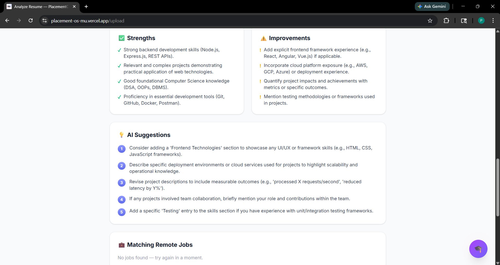

*Each suggestion is tailored to the exact job description you uploaded — real intelligence, not templates.*

---

### 🗂️ Explore AI Tools — 13+ Tools in One Grid
> Interview Prep, Cover Letter, Resume Builder, Salary Check, LinkedIn Tips + Placement Ecosystem

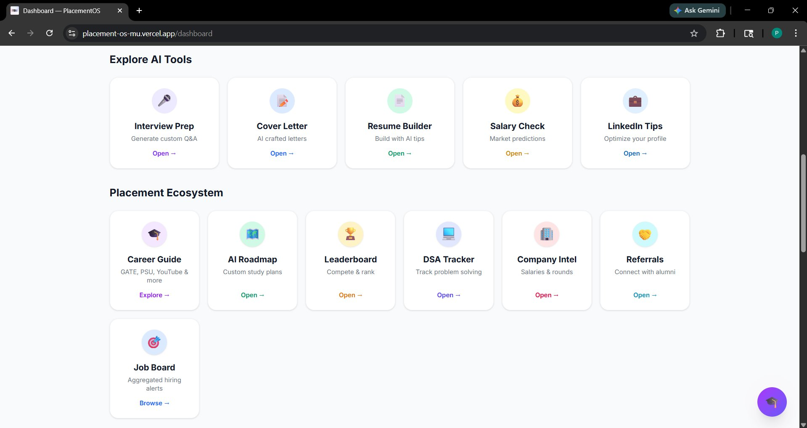

---

### 🏆 Real-World Tools + Student Toolkit
> Resume Roast, Mock Interview, Skill Gap, Job Tracker, Campus Data + Free Resources, Hackathons

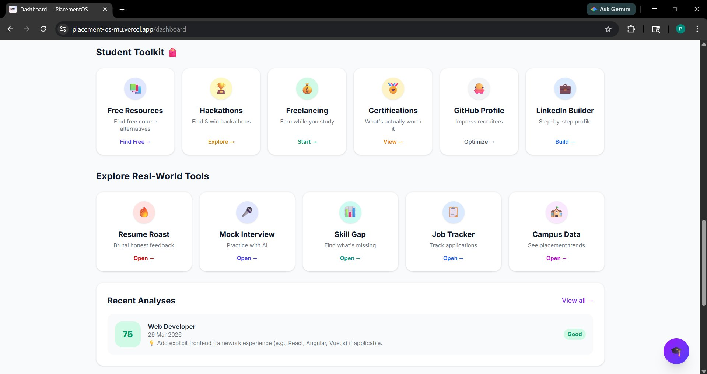

*Recent Analyses card: Web Developer | 29 Mar 2026 | Score: 75 | Status: Good*

---

### 🦶 Footer — Professional Branding
> Creator info, all social links, complete site navigation

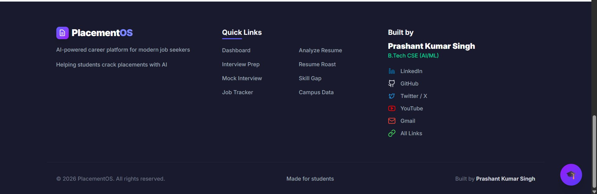

---

## 🏗️ Architecture & Tech Stack

```
┌─────────────────────────────────────────────────────────────┐
│                        FRONTEND                             │
│        React.js + TypeScript + Tailwind CSS                 │
│                    Deployed on Vercel                       │
│  ┌──────────┐ ┌──────────┐ ┌──────────┐ ┌──────────┐      │
│  │Dashboard │ │ Analyze  │ │  Tools   │ │ History  │      │
│  └──────────┘ └──────────┘ └──────────┘ └──────────┘      │
└──────────────────────┬──────────────────────────────────────┘
                       │ HTTPS REST API
┌──────────────────────▼──────────────────────────────────────┐
│                        BACKEND                              │
│           Node.js + Express + TypeScript                    │
│                    Deployed on Render                       │
│  ┌──────────┐ ┌──────────┐ ┌──────────┐ ┌──────────┐      │
│  │  /upload │ │/analyses │ │/history  │ │  /stats  │      │
│  └──────────┘ └──────────┘ └──────────┘ └──────────┘      │
└────────┬─────────────────────────┬───────────────┬──────────┘
         │                         │               │
┌────────▼──────┐   ┌──────────────▼──┐   ┌───────▼──────────┐
│   MongoDB     │   │    Supabase     │   │    AI Service    │
│  (Analyses,   │   │  Authentication │   │ Resume Analysis  │
│   History,    │   │  User Sessions  │   │ Mock Interview   │
│   UserData)   │   │  Row-level RLS  │   │ Cover Letter Gen │
└───────────────┘   └─────────────────┘   └──────────────────┘
```

### Tech Stack — Why Each Choice

| Layer | Technology | Why This Choice |
|---|---|---|
| **Frontend** | React.js + TypeScript | Component reusability, type safety, fast UI updates |
| **Styling** | Tailwind CSS | Rapid development, consistent design system, no CSS bloat |
| **Backend** | Node.js + Express + TypeScript | Non-blocking I/O perfect for AI API calls, full type safety |
| **Database** | MongoDB | Flexible schema for evolving JSON-based analysis data |
| **Auth** | Supabase | Built-in RLS, JWT sessions, Google OAuth — production-grade security |
| **AI** | External AI API | Contextual NLP for semantic resume evaluation |
| **Frontend Deploy** | Vercel | Instant CI/CD, global edge network, zero-config for React |
| **Backend Deploy** | Render | Auto-deploy from GitHub, persistent Node.js process |

---

## 🧠 Key Technical Challenges Solved

> These are real problems I debugged and solved during development — not just theory.

| Challenge | Root Cause | Solution |
|---|---|---|
| **Dashboard showing 0 data** despite resumes being uploaded | Backend `/history` endpoint was reading from wrong collection | Fixed endpoint to correctly read from `analyses` MongoDB collection + created `ActivityHistory.ts` model |
| **Auth session not persisting** across page refresh | Supabase JWT token not being stored properly | Implemented proper session management with auto-refresh token handling |
| **Resume PDF parsing failing** for some files | No error handling for malformed/scanned PDFs | Added structured extraction with try-catch + user-friendly error messages |
| **AI API rate limiting** causing failed requests | No queuing system for concurrent users | Added request queuing + graceful fallback error handling |
| **Frontend-backend data mismatch** | Field names inconsistent between API response and React state | Fixed by aligning TypeScript interfaces on both sides |
| **Render backend cold starts** causing slow first load | Free tier spins down after inactivity | Added keep-alive ping + loading states in frontend for better UX |

---

## ⚙️ Installation & Setup

### Prerequisites
```bash
Node.js >= 18.x
npm >= 9.x
MongoDB Atlas account
Supabase account
```

### 1. Clone
```bash
git clone https://github.com/PrashantSinghUP64/PlacementOS.git
cd PlacementOS/PlacementOS
```

### 2. Install Dependencies
```bash
npm install
cd server && npm install && cd ..
```

### 3. Environment Variables

**Frontend `.env`:**
```env
VITE_SUPABASE_URL=your_supabase_url
VITE_SUPABASE_ANON_KEY=your_supabase_anon_key
VITE_API_URL=http://localhost:5000
```

**Backend `server/.env`:**
```env
PORT=5000
MONGODB_URI=your_mongodb_connection_string
SUPABASE_URL=your_supabase_url
SUPABASE_SERVICE_ROLE_KEY=your_service_role_key
AI_API_KEY=your_ai_api_key
```

### 4. Run
```bash
# Terminal 1 — Backend
cd server && npm run dev

# Terminal 2 — Frontend
npm run dev
```

| Service | URL |
|---|---|
| Frontend | `http://localhost:5173` |
| Backend API | `http://localhost:5000` |

---

## 🌐 Deployment

| Service | Platform | Status |
|---|---|---|
| Frontend | Vercel | ✅ Live |
| Backend API | Render | ✅ Live |
| Database | MongoDB Atlas | ✅ Live |
| Auth | Supabase | ✅ Live |

🔗 **Live App:** [https://placement-os-mu.vercel.app](https://placement-os-mu.vercel.app)

---

## 💡 What Makes It Unique

| Feature | PlacementOS | Jobscan | ResumAI | LinkedIn |
|---|---|---|---|---|
| India Campus Placement focus | ✅ | ❌ | ❌ | ❌ |
| 20+ integrated tools | ✅ | ❌ | ❌ | ❌ |
| DSA Tracker built-in | ✅ | ❌ | ❌ | ❌ |
| Leaderboard & gamification | ✅ | ❌ | ❌ | ❌ |
| Company Intel (Indian companies) | ✅ | ❌ | ❌ | Partial |
| Score progress tracking over time | ✅ | ❌ | ❌ | ❌ |
| Free to use | ✅ | ❌ Paid | ❌ Paid | Partial |
| Full-stack owned platform | ✅ | ❌ | ❌ | ❌ |

---

## 🗺️ Roadmap

- [x] AI Resume Analyzer with ATS Score
- [x] Score Progress Dashboard with chart
- [x] Mock Interview (AI-powered)
- [x] Resume Roast
- [x] Skill Gap Analysis
- [x] Cover Letter Generator
- [x] Job Tracker
- [x] DSA Tracker
- [x] Leaderboard
- [x] Company Intel & Campus Data
- [x] Referrals Network
- [x] Student Toolkit (20+ resources)
- [x] Google OAuth + OTP Login
- [ ] Mobile App (React Native)
- [ ] Email notifications for job alerts
- [ ] Resume version comparison
- [ ] College-specific placement analytics
- [ ] Premium tier with unlimited AI calls

---

## 👤 About the Creator

<div align="center">

**Prashant Kumar Singh**
B.Tech CSE (AI/ML)

*"I built PlacementOS because I wanted placement prep to be less stressful and more intelligent for every engineering student in India."*

</div>

| Platform | Link |
|---|---|
| 💼 LinkedIn | [linkedin.com/in/prashant-kumar-singh-51b225230](https://www.linkedin.com/in/prashant-kumar-singh-51b225230/) |
| 🐙 GitHub | [github.com/PrashantSinghUP64](https://github.com/PrashantSinghUP64) |
| 🐦 Twitter / X | [x.com/prashant_UP_64](https://x.com/prashant_UP_64) |
| 📺 YouTube | [Technical Knowledge Hindi](https://www.youtube.com/@technicalknowledgehindi1949) |
| 🔗 All Links | [linktr.ee/Prashantsingh64](https://linktr.ee/Prashantsingh64) |
| 📧 Email | [ps7027804@gmail.com](mailto:ps7027804@gmail.com) |

---

## 🤝 Contributing

1. Fork the Project
2. Create Feature Branch (`git checkout -b feature/AmazingFeature`)
3. Commit Changes (`git commit -m 'feat: Add AmazingFeature'`)
4. Push (`git push origin feature/AmazingFeature`)
5. Open Pull Request

---

## 📄 License

```
MIT License — Copyright (c) 2024-2026 Prashant Kumar Singh
Attribution required. See LICENSE file for full details.
```

---

<div align="center">

**If this project helped you — drop a Star. It keeps me going.**

*Built from scratch by a student, for students.*
*Every line of code written with one goal — Prepare better. Get placed faster.*

**© 2024–2026 PlacementOS | Prashant Kumar Singh | B.Tech CSE (AI/ML)**

</div>
